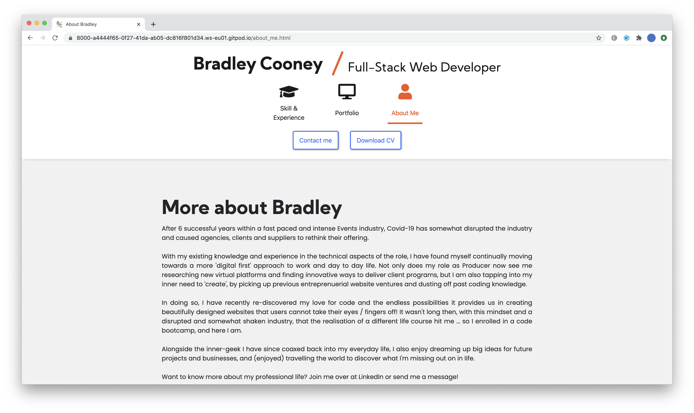
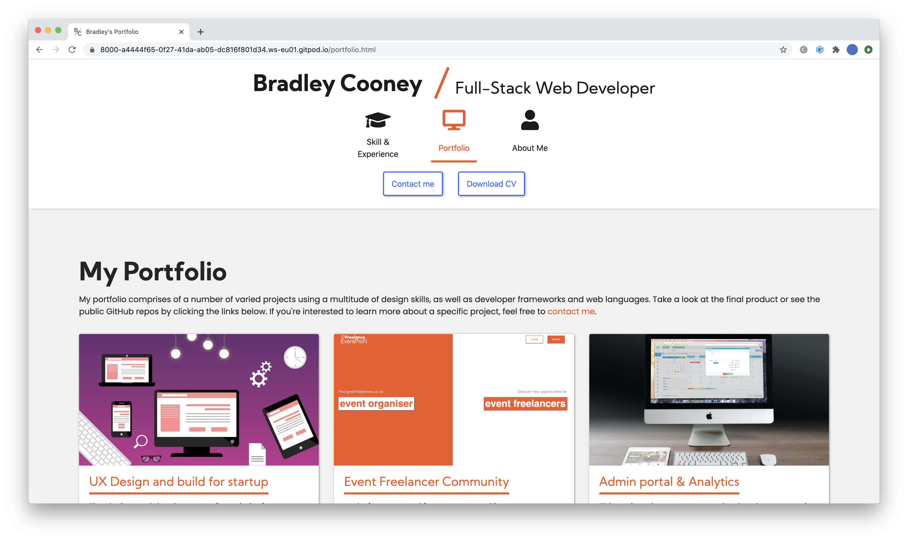

# MS1 - Bradley Cooney Portfolio Website

This website has been created to demonstrate to recruiters and potential employers my key skills and experience in Full-Stack Web Development as the site owner.

 

## **UX Design**

The UX of this site has been designed with user ease and simplicity in mind. As a portfolio website designed to demonstrate the key skills of the site owner, it is important that end-users are not overwhelmed with too many options and paths to collect the information they are on the site to gather, as this may illicit a negative emotional response, causing them to abandon the site.

### User Story - Recruiter

As a recruiter, I want to quickly find out information about the site owner, and understand whether they have the key capabilities determined by my client's requirements, making them suitable for the role. I am not a technical user, and therefore it's important that I can compare the skills listed with the brief provided to me by my client. Any advanced technical language or lack of clarity in expertise is likely to deter me from this site as I have many other sites to view in a short period of time. I want to very quickly make a decision on whether the site owner is suitable for the role.

<!--The first end user type for this website will be recruiters who are looking for developers on behalf of their clients. As a less technical user, their primary objective when visiting the site, is to understand whether the site owner is a suitable candidate for a client's role, based on the criteria set out.

This user is likely to view many sites similar to this one, and therefore is likely to spend as little time as necessary to understand the site owners capabilities. To ensure that this user can meet their objectives quickly before they move on to other sites, this site needs to help the user navigate the key areas as quickly and efficiently as possible.-->
### User story - non-technical hiring manager
As a non-technical hiring manager, I am going to be looking for a skill set that meets the criteria set out by a technical colleague. Once I have confirmed whether the site owner has these skills, my focus will then be on the soft skills the owner posesses - understanding more about how they work with people as part of a team and whether they would be a good culture fit for the organisation. If I am satisfied
that the site owner fulfills the criteria, then I would be looking to download or share the CV with a technical colleague, before contacting the site owner. 

### User story - technical hiring manager

Like recruiters, I want to be able to quickly understand whether the site owner has the capabilities to join our organisation in the technical role we are hiring for. Whilst I also lack the time to read everything on the website, I have more of an understanding in technical language used, and whilst I cannot read everything, I would be looking to understand to what level the site owner can perform the skills shown to see how that would suit the role and compliment the other skills within the organisation. If the site owner's skills are of interest, then I want to be able to look into their previous work and code structure to validate the skills advertised.

### User story - The site owner

As site owner, I want to be able to promote my key skills and experience to potential employers and those users who are in need of a Full-stack Developer. I want end-users of the site to be able to quickly, but accurately, make a decision on my suitability for their organisation. I also want users to contact me before they leave the site to ensure I do not miss out on potential work opportunities.

<!--
Use this section to provide insight into your UX process, focusing on who this website is for, what it is that they want to achieve and how your project is the best way to help them achieve these things.

In particular, as part of this section we recommend that you provide a list of User Stories, with the following general structure:
- As a user type, I want to perform an action, so that I can achieve a goal.

This section is also where you would share links to any wireframes, mockups, diagrams etc. that you created as part of the design process. These files should themselves either be included as a pdf file in the project itself (in an separate directory), or just hosted elsewhere online and can be in any format that is viewable inside the browser.
-->
 

---
 

## **Features**

To ensure users can quickly navigate the site and view the information they need, the feature set is minimal. 

### Existing Features

- <strong>Contact form</strong> - allows users to contact the site owner with a simple subject and message, with contact details of the sender required for return contact.
- <strong>Download CV</strong> -  allows users to download a CV of the site owner that can be printed and reviewed or shared with others.
- <strong>View portfolio</strong> - users can view existing portfolio projects on the 'Portfolio' page. Each portfolio project allows users to view the live site and the GitHub repo.
- <strong>View skillset</strong> - users can view site owners existing skillset and understand competence through colour code. Upon clicking on each skill, users can see how the skill was obtained.
- <strong>External Social</strong> - users can view LinkedIn profile and GitHub repo by clicking on the links in the footer.

<em>Note: 
- The action for the contact form is currently set to open the Code Institute data dump page as a new tab. When the form is connected to a back-end database in further versions, it will show a 'Thank you for submitting' message within the modal.
- Download CV currently opens CI Assessment Handbook in new tab in place of CV, which will be added in future versions.
- Portfolio projects 'View Site' buttons are currently linked back to a 'dummy' page until projects are added in future versions.</em>
 

 

---
 

## **Technologies Used**

This site uses minimal technologies to deliver a simple and intuitive UI and UX for the user. 

The codebase is written in HTML, with CSS. In addition to core CSS, it also utilises the below frameworks:

<strong>Javascript</strong>    
- JQuery - https://jquery.com   - For the implementation of the AOS fade animation used on 'Experience' section
- Bootstrap - https://stackpath.bootstrapcdn.com/bootstrap/4.5.2/js/bootstrap.min.js   - For core Bootstrap interactivity such as modals and mobile navbar

<strong>CSS</strong>    
- Fontawesome - https://use.fontawesome.com/releases/v5.14.0/css/all.CSS   - For icons in Navbar and social icons (LinkedIn & GitHub)
- Bootstrap - https://stackpath.bootstrapcdn.com/bootstrap/4.5.2/css/bootstrap.min.css"   - As the core structural library. Base styles are then amended within the style.css file
- Google Fonts - https://fonts.google.com/   - Used to import fonts into CSS file

 

___
 

## **Testing**

Testing has taken place throughout development of this site, to ensure modules and pages align to user goals throughout. As this site does not utilise interactive languages such as Javascript, testing has taken place manually based on user goals.
 
 

### User story testing

Goal: Quickly check off skill set criteria based on client requirements, and contact site owner if criteria met (Recruiter, Technical Hiring Manager, Site Owner for contact form).

Test: 
1. Check skill set by clicking on 'Skills' page. 
2. Click on each skill to establish aptitude for each skill.
3. Click on 'Contact Me' in navbar to open a contact form.
    1. Try to complete the form without entering required fields. Form should not submit.
    2. Try to complete the form with text only data, but 'Phone' and 'Email' should fail, requiring valid number and character formatting. 
    3. Try to complete form with data in required fields and as per input formats. Upon submitting form, 
        1. A new tab should open showing Code Institute data dump completion page to confirm successful submission.

 
Goal: Confirm skillset criteria matched, then review soft-skills, previous experience and download CV (Non-technical hiring manager).

Test: 
1. Check skill set by clicking on 'Skills' page. 
2. Scroll down page to view 'Experience'.
3. Each experience item should fade in as page scrolls down.
4. Click on 'About Me' in Navbar - should show Body copy text under 'More about Bradley' header.
5. Click on 'Download CV' in navbar.
    1. New tab should open to show 'CI Assessment Guide' pdf (as dummy content) if successful.

 
Goal: Further review skills application through previous work (Technical Hiring Manager).

Test:
1. Go to 'Portfolio' page
2. Click on project card title or image
    1. This should open a new tab called 'Dummy Content' to ensure the test link worked.
3. Click on the button 'GitHub Repo'
    1. If successful, a new tab will open showing the Git Profile
3. Click on the LinkedIn icon in the footer
    1. If successful, a new tab will open showing the LinkedIn Profile

 

### Browser & Device Compatibility
<!-- To fix:
> Breakpoint on tablet for portfolio
> Remove padding on tablet devices - all pages

-->

The site has been tested across the latest browser versions of Chrome, Safari, Firefox. In addition, it has been tested for phone and tablet, on both Chrome developer tools, as well as from mobile browsers using the deployed GitHub pages site. 

For mobile, the following changes have been made to optimise usability:
- Upon testing across screen sizes, it was discovered that the default Bootstrap 'col' class needed to be added for each screen breakpoint, to ensure items such as the portfolio cards are stacked vertically on mobile, vs horizontally on desktop and tablet. 
- The section padding has also been reduced for mobile to ensure easier readability with as reduced scrolling as possible.
- Navbar compresses into 'hamburger nav' with a dropdown for menu items to reduce navbar screen real estate
- Footer information is stacked vertically using Bootstrap 'col' classes to ensure page remains within screen width

<!--

In this section, you need to convince the assessor that you have conducted enough testing to legitimately believe that the site works well. Essentially, in this part you will want to go over all of your user stories from the UX section and ensure that they all work as intended, with the project providing an easy and straightforward way for the users to achieve their goals.

Whenever it is feasible, prefer to automate your tests, and if you've done so, provide a brief explanation of your approach, link to the test file(s) and explain how to run them.

For any scenarios that have not been automated, test the user stories manually and provide as much detail as is relevant. A particularly useful form for describing your testing process is via scenarios, such as:

1. Contact form:
   1. Go to the "Contact Us" page
   2. Try to submit the empty form and verify that an error message about the required fields appears
   3. Try to submit the form with an invalid email address and verify that a relevant error message appears
   4. Try to submit the form with all inputs valid and verify that a success message appears.

In addition, you should mention in this section how your project looks and works on different browsers and screen sizes.

You should also mention in this section any interesting bugs or problems you discovered during your testing, even if you haven't addressed them yet.

If this section grows too long, you may want to split it off into a separate file and link to it from here.
-->
 

___
 

## **Deployment**

The live site is deployed on Gitpages as only frontend, static HTML & CSS files are required to be served to the user. The deployment was initiated following the initial commit to allow for discrepancy testing between the development build and production build.

The development environment exists within GitPod and all code is created, edited and pushed from the GitPod site. 

Common differences between the development site and production on GitPages are the folder path for images, which has been corrected upon testing on the live production deployment. 

 

___
 

## **Credits**

### Frameworks and Libraries

The CSS and Javascript libraries uses within this site are:
- Bootstrap Hamburger mobile navbar <strong>[MDBootstrap]</strong> - https://mdbootstrap.com/docs/jquery/navigation/hamburger-menu/
- Bootstrap animations on scroll on experience page <strong>[Nice Snippets]</strong> - https://www.nicesnippets.com/snippet/web-page-scroll-animation-demo-usign-aos-and-bootstrap-4
- JQuery library - https://jquery.com   - For the implementation of the AOS fade animation used on 'Experience' section
- Bootstrap library - https://stackpath.bootstrapcdn.com/bootstrap/4.5.2/js/bootstrap.min.js   - For core Bootstrap interactivity such as modals and mobile navbar
- Fontawesome - https://use.fontawesome.com/releases/v5.14.0/css/all.CSS   - For icons in Navbar and social icons (LinkedIn & GitHub)
- Bootstrap - https://stackpath.bootstrapcdn.com/bootstrap/4.5.2/css/bootstrap.min.css"   - As the core structural library. Base styles are then amended within the style.css file
- Google Fonts - https://fonts.google.com/   - Used to import fonts into CSS file

### Media

The images within this site are gathered under creative commons or royalty free licences:
- Homepage background image - https://unsplash.com/@alesnesetril 
- Portfolio project 1 - https://pixabay.com/users/kreatikar-8562930/
- Portfolio project 2 - own image used - no attribution required
- Portfolio project 3 - Image credit: Pixabay | https://www.pexels.com/@pixabay

### Acknowledgements

- I received inspiration for this project from the Code Institute User Centric Frontend Development module mini-project. Specifically the timeline element on the Skills & Experience page. 
