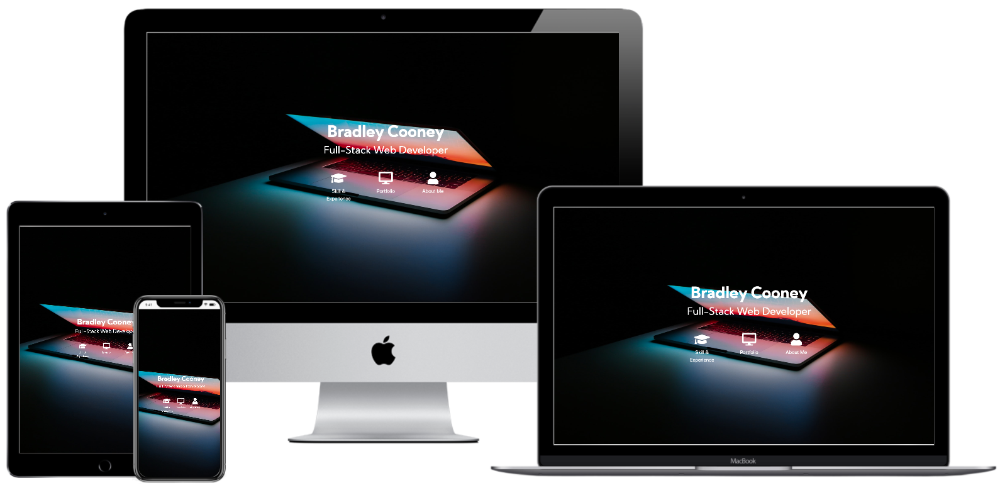
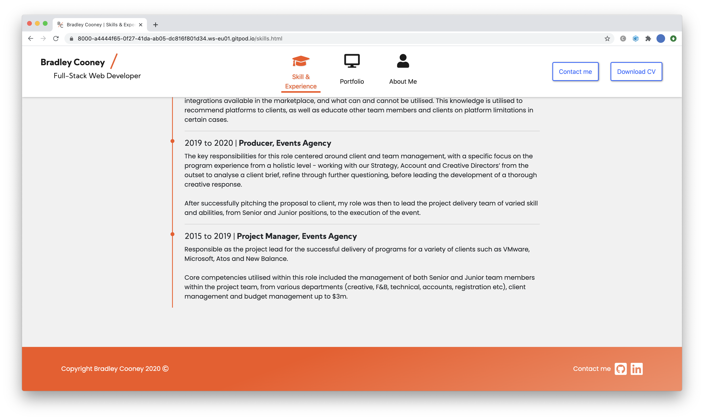
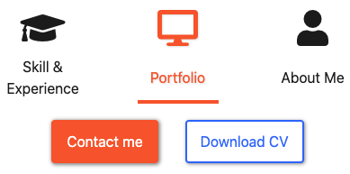
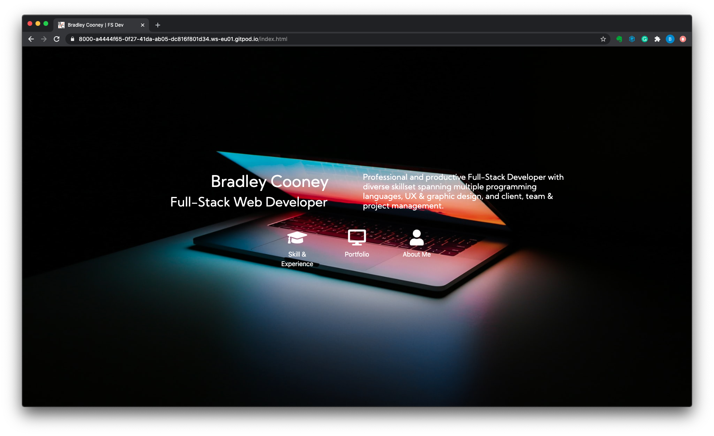
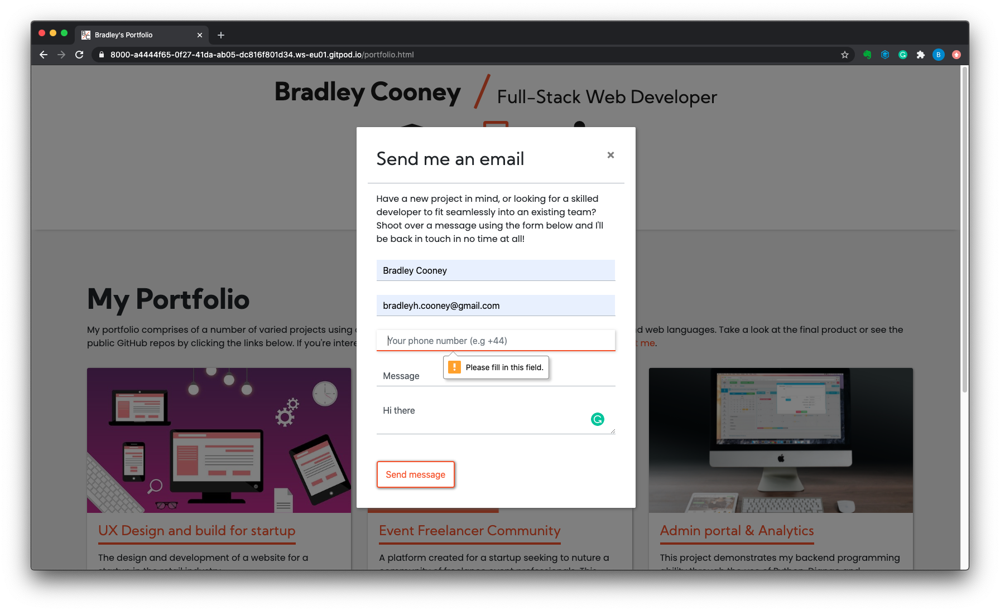
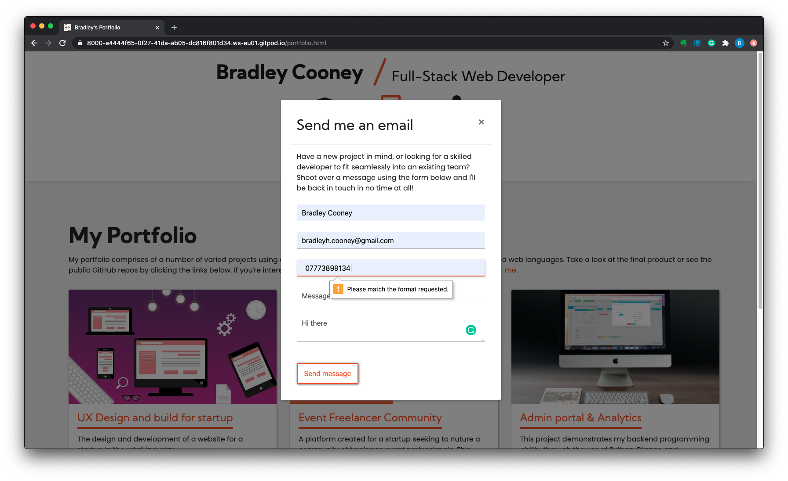
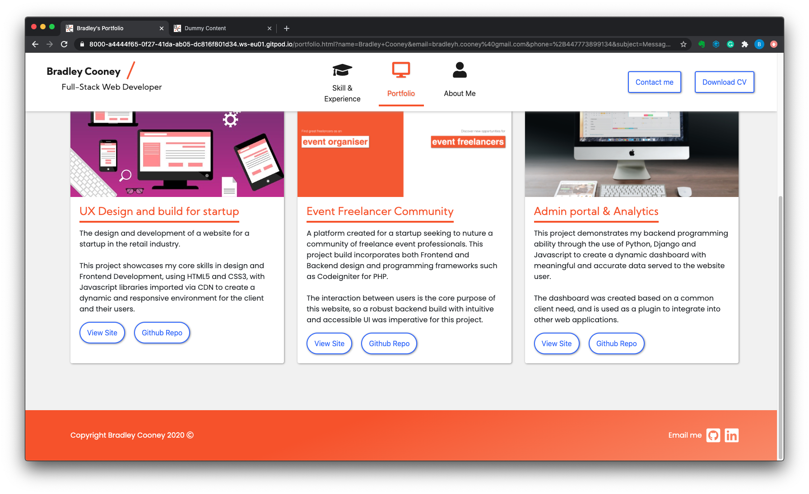

# MS1 - Bradley Cooney Portfolio Website

This website has been created to demonstrate to recruiters and potential employers my key skills and experience in Full-Stack Web Development as the site owner.

<a  target="_blank" href="https://bradleyhc.github.io/MS1-portfolio" />You can view the deployed site here</a>
 

- [Features](#Features)  

# **UX Design**

The UX of this site has been designed with user ease and simplicity in mind.
As a portfolio website designed to demonstrate the key skills of myself, as the site owner, it is important that end-users are not overwhelmed with too many options and paths to collect the information they are on the site to gather, as this may elicit a negative emotional response, causing them to abandon the site.

 

## **User Stories**

The anticipated site users can be classified as both technical and non-technical professionals who are either looking to recruit Full-Stack Developers directly or for their client / colleague, or users who are looking to have a site built. These users share a number of goals, as well as have their own specific goals, as outlined below:

1. **First Time User Goals**
   - As a first time user, I want to be able to quickly check the site owner’s skills and expertise against a predetermined set of criteria.
   - As a first time user, I want to be impressed by the visual aesthetics and functionality of this site, and have confidence that the site owner could create something similar for me, my organisation, or my client.
   - As a first time user, I want to be able to contact the site owner for potential work opportunities.

1. **Technical Hirer Goals**
    - As a technical hirer, I want to be able to view the site owner’s aptitude for each skill.
    - As a technical hirer, I want to be able to view the site owner’s other projects and portfolio.
    - As a technical hirer, I want to be able to locate and view the site owner’s GitHub profile to establish their code writing competence.

1. **Non-technical Hirer Goals**
    - As a non-technical hirer, I want to be able to view the site owner’s soft-skills and understand what experience they have.
    - As a non-technical hirer, I want to view the site owner’s LinkedIn profile so I can see their work history.
    - As a non-technical hirer, I want to be able to print or quickly share the site owner's CV with others if applicable.

1. **Site Owner Goals**
   - As site owner, I want to elicit a positive emotional response when users first land on the site
   - As site owner, I want users to quickly discover my key skills and capabilities, before their attention is drawn from the site.
   - As site owner, I want users to contact me with ease for possible work opportunities.

<!-- ### User Story - Recruiter

As a recruiter, I want to quickly find out information about the site owner, and understand whether they have the key capabilities determined by my client's requirements, making them suitable for the role. I am not a technical user, and therefore it's important that I can compare the skills listed with the brief provided to me by my client. Any advanced technical language or lack of clarity in expertise is likely to deter me from this site as I have many other sites to view in a short period of time. I want to very quickly make a decision on whether the site owner is suitable for the role.

### User story - non-technical hiring manager

As a non-technical hiring manager, I am going to be looking for a skill set that meets the criteria set out by a technical colleague. Once I have confirmed whether the site owner has these skills, my focus will then be on the soft skills the owner posesses - understanding more about how they work with people as part of a team and whether they would be a good culture fit for the organisation. If I am satisfied
that the site owner fulfills the criteria, then I would be looking to download or share the CV with a technical colleague, before contacting the site owner.

### User story - technical hiring manager

Like recruiters, I want to be able to quickly understand whether the site owner has the capabilities to join our organisation in the technical role we are hiring for. Whilst I also lack the time to read everything on the website, I have more of an understanding in technical language used, and whilst I cannot read everything, I would be looking to understand to what level the site owner can perform the skills shown to see how that would suit the role and compliment the other skills within the organisation. If the site owner's skills are of interest, then I want to be able to look into their previous work and code structure to validate the skills advertised.

### User story - The site owner

As site owner, I want to be able to promote my key skills and experience to potential employers and those users who are in need of a Full-stack Developer. I want end-users of the site to be able to quickly, but accurately, make a decision on my suitability for their organisation. I also want users to contact me before they leave the site to ensure I do not miss out on potential work opportunities.
 -->

 

## **Design**

### Colour Scheme

The primary colours used within this site are white, orange and an off-white / light grey. This colour scheme is simple, but eye catching. The white allows th black text and key icons to stand out, whilst the off-white ensures that the body text is easier to read and users are not deterred from an overly bright page.

The orange colour is used to help break up the page when there is lots of black text (as borders or underlining text) and draw the users attention to key areas of the page, such as call to action buttons.

 

### Typography

The 'Kumbh Sans' Google font is the main font used throughout the website with Sans Serif as the fallback font in case for any reason the font isn't being imported into the site correctly.

Kumbh Sans is a clean, contemporary and easy to read font that stands out to the user with it's bold, sans-serif qualities.

 

### Imagery

Imagery is important within UX design as it is typically the first impactful visual users see. The colours and context quickly set the tone for the rest of the site and provoke the first emotional response from the user. The large background hero image on this website's homepage is designed to be striking and catch the user's attention.

Since the background image is a simple laptop in a dark environment, the user's attention is immediately drawn to the colour in the center of the screen, with little distraction. The choice of image immediately informs the user that the website is related to development or technology. 

Positioning the nav icons and title in the foreground, enables users to see exactly what, in relation to Tech / Development, the site is about - a developer portfolio.

## **Wireframes**

You can view both the desktop and mobile wireframe <a  target="_blank" href="./documentation/MS1-BradleyCooney-Wireframe.pdf">here</a>

The final site functionality and design follows the layout and intent shown within the wireframe, with the exception of a few smaller functionality changes:

- The navbar was intended to be a tabulated so the skills / portfolio / about me page is only required to load once, with content shown when each nav icon is clicked. Since this functionality would require Javascript to implement, the decision was made to separate each section as a page instead.
- The navbar icons no longer scale in size when page is selected. This feature was removed to improve useability, as the increased icon size would take up a considerable portion of the screen, requiring users to scroll down further to view all content.
- The 'contact me' button on the homepage was removed to ensure users enter the site and read the content before clicking the call to action.

---

 

## **Features**

To ensure users can quickly navigate the site and view the information they need, the feature set is minimal.

### Existing Features

- <strong>Contact form</strong> - allows users to contact the site owner with a simple subject and message, with contact details of the sender required for return contact.
- <strong>Download CV</strong> - allows users to download a CV of the site owner that can be printed and reviewed or shared with others.
- <strong>View portfolio</strong> - users can view existing portfolio projects on the 'Portfolio' page. Each portfolio project allows users to view the live site and the GitHub repo.
- <strong>View skillset</strong> - users can view site owners existing skillset and understand competence through colour code. Upon clicking on each skill, users can see how the skill was obtained.
- <strong>External Social</strong> - users can view LinkedIn profile and GitHub repo by clicking on the links in the footer.

<em>Note:

- The contact form does not currently submit data. When the form is connected to a back-end database in further versions, it will show a 'Thank you for submitting' message within the modal.
- Portfolio projects 'View Site' buttons are currently linked back to a 'dummy' page until projects are added in future versions.</em>
   

 

---

 

## **Technologies Used**

This site uses minimal technologies to deliver a simple and intuitive UI and UX for the user.

The codebase is written in HTML5, with CSS3. In addition to core CSS, it also utilises the below libraries and frameworks:

<strong>Javascript</strong>

- <a  target="_blank" href="https://jquery.com">JQuery</a> - For the implementation of the AOS fade animation used on 'Experience' section
- <a  target="_blank" href="https://stackpath.bootstrapcdn.com/bootstrap/4.5.2/js/bootstrap.min.js">Bootstrap</a> - For core Bootstrap interactivity such as modals and mobile navbar

<strong>CSS</strong>

- <a  target="_blank" href="https://use.fontawesome.com/releases/v5.14.0/css/all.CSS">Fontawesome</a> - For icons in Navbar and social icons (LinkedIn & GitHub)
- <a  target="_blank" href="https://stackpath.bootstrapcdn.com/bootstrap/4.5.2/css/bootstrap.min.css">Bootstrap</a> - As the core structural library. Base styles are then amended within the style.css file
- <a  target="_blank" href="https://fonts.google.com/">Google Fonts</a> - Used to import fonts into CSS file for styling

<strong>Other</strong>

- <a  target="_blank" href="https://github.com">GitHub</a> - used for version control, hosting of codebase and deploying live website on GitHub Pages
- <a  target="_blank" href="https://gitpod.io">GitPod</a> - used as code editor, connected with GitHub to push commits directly to GitHub repository
- <a  target="_blank" href="https://balsamiq.com">Balsamiq</a> - used to create wireframes for project

 

---

 

## **Testing**

Testing has taken place throughout development of this site, to ensure modules and pages align to user goals throughout. As this site does not utilise interactive languages such as Javascript, testing has taken place manually based on user goals.

 

### Validator Results

Throughout the testing phase of this project build, W3C HTML validator and Jigsaw W3 CSS validator have been used to identify any errors within the code, enabling a fix to be implemented.

The results from both can be seen below:

- <a target="_blank" href="https://validator.w3.org/nu/?doc=https%3A%2F%2Fbradleyhc.github.io%2FMS1-portfolio%2F">W3C HTML Validation Results</a>
- <a target="_blank" href="https://jigsaw.w3.org/css-validator/validator?uri=https%3A%2F%2Fbradleyhc.github.io%2FMS1-portfolio%2F&profile=css3svg&usermedium=all&warning=1&vextwarning=&lang=en">Jigsaw CSS Validator</a>
  - The CSS validation is currently showing errors within CSS files that are imported into the website through CDN e.g Bootstrap and Fontawesome with the common error 'unknown vendor error', which is currently not possible to fix. All local CSS errors in 'assets/css/style.css' have been fixed.

### User story testing

To ensure they can be achieved, each of the user goals noted above in the User Experience section have been tested, both technically and through peer / user review. The details of each are outlined below.

 

### 1. **First Time User Goals**
   
> As a first time user, I want to be able to quickly check the site owner’s skills and expertise against a predetermined set of criteria.        

1. This is achieved by a clearly identifiable 'Skill & Experience' navigation item.  
2. On the 'Skill & Experience' page, users can clearly see above the fold the skills the site owner has.  

> As a first time user, I want to be impressed by the visual aesthetics and functionality of this site, and have confidence that the site owner could create something similar for me, my organisation, or my client.

1. This is achieved by a clear, uncluttered homepage with a striking, colourful background image that focusses the user eye to the center of the screen and the subsequent navigation.
1. The user can also see a quick summary of the site owner by hovering on the name / title

> As a first time user, I want to be able to contact the site owner for potential work opportunities.
1. Click on 'Contact Me' in navbar to open a contact form.  
    1. Try to complete the form without entering required fields. Form should not submit.    
    1. Try to complete the form with text only data, but 'Phone' and 'Email' should fail, requiring valid number and character formatting.   
    1. Try to complete form with data in required fields and as per input formats.   
    1. If successful, the page should refresh back to the current page.

 

### 2. **Technical Hirer Goals**
> As a technical hirer, I want to be able to view the site owner’s aptitude for each skill.     

1. Check skill set by clicking on 'Skills' page.
1. Click on each skill to establish aptitude for each skill.

> As a technical hirer, I want to be able to view the site owner’s other projects and portfolio.
1. The user can achieve this by clicking on the 'Portfolio' nav item
    1. Click on project card title or image
    1. This should open a new tab called 'Dummy Content' to ensure the test link worked (future releases will feature real project deployments).

> As a technical hirer, I want to be able to locate and view the site owner’s GitHub profile to establish their code writing competence.
1. The user can achieve this by clicking on any of the 'GitHub Repo' call to action buttons on each project card, or by clicking the GitHub icon in the footer 
    1. Click on the button 'GitHub Repo'
    1. If successful, a new tab will open showing the Git Profile

 

### 3. **Non-technical Hirer Goals**
> As a non-technical hirer, I want to be able to view the site owner’s soft-skills and understand what experience they have.
1. Users can achieve this by clicking on the 'Skill & Experience' page and scrolling down to the experience timeline.
    1. The timeline should populate three entries as the user scrolls.
1. The user can also view the personal statement of the site owner by clicking on the 'About Me' nav item.

> As a non-technical hirer, I want to view the site owner’s LinkedIn profile so I can see their work history.
1. This can be achieved by clicking the LinkedIn icon in the footer, or the call to action button at the bottom of the 'About Me' page.
    1. Click on the LinkedIn icon in the footer.
    1. If successful, a new tab will open showing the LinkedIn Profile.

> As a non-technical hirer, I want to be able to print or quickly share the site owner's CV with others if applicable.
1. This is achieved with the clear 'Download CV' button in the navbar.
    1. Click on 'Download CV' in navbar.
    1. New tab should open to show 'Bradley Cooney CV' pdf if successful. This can then be downloaded or printed.

 

### 4. **Site Owner Goals**
> As site owner, I want to elicit a positive emotional response when users first land on the site
1. This is achieved by the clear, impactful homepage with a distinctly shows what content will be contained within the site, with the use of the laptop background image.

> As site owner, I want users to quickly discover my key skills and capabilities, before their attention is drawn from the site.    
1. The user can achieve this through a clear 'Skill & Experience' nav item on the homepage
1. When the 'Skill & Experience' page loads, the user can immediately see the key skills with a bold heading and the list, above the fold. 
1. The colour coding of the skills quickly informs the user which skills the site owner is stronger at and which have less experience.

> As site owner, I want users to contact me with ease for possible work opportunities.
1. This can be achieved with the clear call to action buttons in the header labelled 'Contact Me' and the 'Email Me' call to action in the footer.  

 

### Browser & Device Compatibility

The site has been tested across the latest browser versions of Chrome, Safari, Firefox. In addition, it has been tested for phone and tablet, on both Chrome developer tools, as well as from mobile browsers using the deployed GitHub Pages site.

For mobile, the following changes have been made to optimise usability:

- Upon testing across screen sizes, it was discovered that the default Bootstrap 'col' class needed to be added for each screen breakpoint, to ensure items such as the portfolio cards are stacked vertically on mobile, vs horizontally on desktop and tablet.
- The section padding has also been reduced for mobile to ensure easier readability with as reduced scrolling as possible.
- Navbar compresses into 'hamburger nav' with a dropdown for menu items to reduce navbar screen real estate.
- Footer information is stacked vertically using Bootstrap 'col' classes to ensure page remains within screen width.
- Homepage further information section that shows when hovering on title was removed on smaller devices to ensure screen real estate is prioritised for the title and navbar.

### Further Testing

- Non-technical friends and colleagues were asked to test the UI as a user and report usability or styling concerns
- Technical peers within the Code Institute program were also asked to review the site. From a technical perspective they offered fixes and improvements which have now been implemented

 

---

 

## **Deployment**

The live site is deployed on GitHub Pages as only frontend, static HTML & CSS files are required to be served to the user.

The deployment was initiated following the below process:

1. Within GitPod, files were committed and pushed to GitHub to create the initial commit.
1. In the GitHub repository, the GitHub Pages was setup - first by clicking 'settings' at the top of the repo.
    1. Scroll to GitHub Pages, create new.
    1. Select the master branch and root folder settings, and ensure that 'enforce HTTPS' is checked.
1. Save the GitHub Pages and after a page refresh, the link is available.
1. The site takes 5 - 10 minutes to pull through.
1. After the site has been successfully deployed, each page is then tested against the development version to identify discrepancies such as styling errors or broken links.

The development environment exists within GitPod and all code is created, edited and pushed from the GitPod site.

Common differences between the development site and production on GitHub Pages are the folder path for images, which has been corrected upon testing on the live production deployment.

 

---

 

## **Credits**

### Frameworks and Libraries

The CSS and Javascript libraries uses within this site are:

- <a href="https://mdbootstrap.com/docs/jquery/navigation/hamburger-menu/">MDBootstrap</a> - Bootstrap Hamburger mobile navbar. 
- <a href="https://www.nicesnippets.com/snippet/web-page-scroll-animation-demo-usign-aos-and-bootstrap-4">Nice Snippets</a> - Bootstrap animations on scroll on experience page. 
- <a href="https://jquery.com">JQuery library</a> - For the implementation of the AOS fade animation used on 'Experience' section.
- <a href="https://stackpath.bootstrapcdn.com/bootstrap/4.5.2/js/bootstrap.min.js">Bootstrap library</a> - For core Bootstrap interactivity such as modals and mobile navbar.
- <a href="https://use.fontawesome.com/releases/v5.14.0/css/all.CSS">Fontawesome</a> - For icons in Navbar and social icons (LinkedIn & GitHub).
- <a href="https://stackpath.bootstrapcdn.com/bootstrap/4.5.2/css/bootstrap.min.css">Bootstrap</a> - As the core structural library. Base styles are then amended within the style.css file.
- <a href="https://fonts.google.com/">Google Fonts</a> - Used to import fonts into CSS file.

### Media

The images within this site are gathered under creative commons or royalty free licences:

- Homepage background image - https://unsplash.com/@alesnesetril
- Portfolio project 1 - https://pixabay.com/users/kreatikar-8562930/
- Portfolio project 2 - own image used - no attribution required
- Portfolio project 3 - Image credit: Pixabay | https://www.pexels.com/@pixabay

### Acknowledgements

- I received inspiration for this project from the Code Institute User Centric Frontend Development module mini-project. Specifically the timeline element on the Skills & Experience page.
- My mentor for the guidance and feedback throughout this project
- The Code Institute slack community for the feedback and testing of the project ahead of completion
